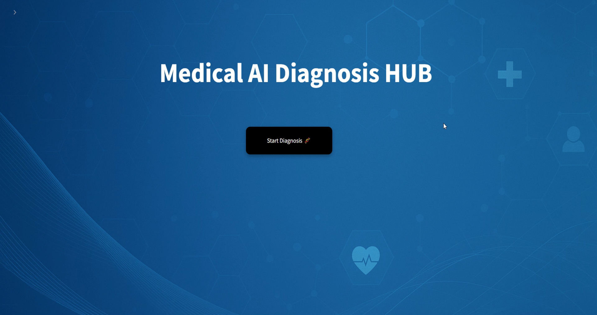
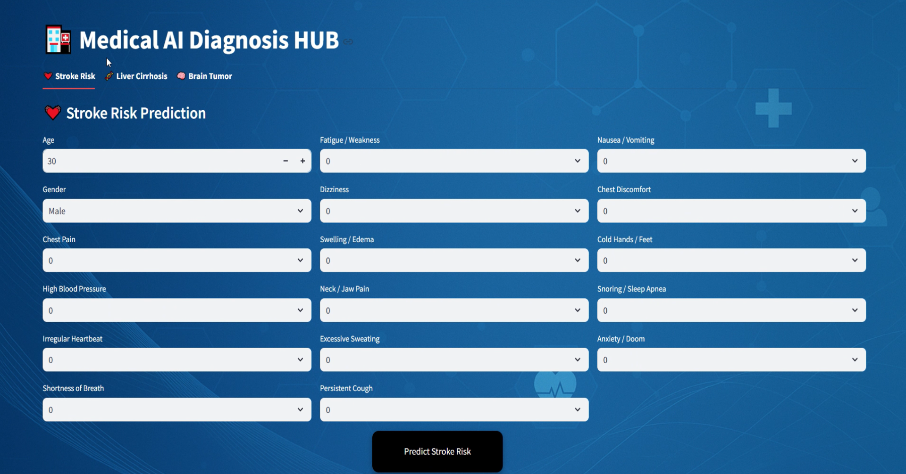
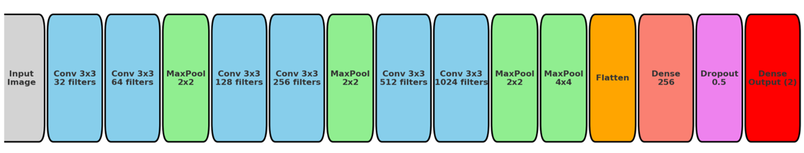

# Medical-AI-Diagnosis-Application
A comprehensive AI-powered web application for medical diagnosis, built with Streamlit, featuring three advanced predictive models:
  - Stroke Risk Prediction
  - Liver Disease Stage Classification (3 stages)
  - Brain Tumor Detection (CT & MRI images)
    
The project integrates data preprocessing, EDA, model training with hyperparameter tuning, cross-validation, and deployment, making it a complete AI solution for healthcare analytics.
- Page 1

- Page 2

# Features
## 1. Stroke Risk Prediction

Predicts the likelihood of stroke using patient clinical data.

Models used:
- Logistic Regression
- Support Vector Machine (SVM)
- Decision Tree
- Random Forest
- XGBoost (best performing model with 98% accuracy)

Techniques applied:
- Data cleaning & preprocessing
- Exploratory Data Analysis (EDA)
- Grid Search hyperparameter tuning
- K-Fold Cross Validation for robust evaluation

## 2. Liver Disease Stage Classification
Classifies liver disease into three stages based on clinical data.

Models used:
- Logistic Regression
- Support Vector Machine (SVM)
- Decision Tree
- Random Forest
- XGBoost (best performing model with 91% accuracy)

Techniques applied:
- Data cleaning & preprocessing
- Exploratory Data Analysis (EDA)
- Grid Search hyperparameter tuning
- K-Fold Cross Validation for robust evaluation
  
## 3. Brain Tumor Detection

- Detects tumor presence in brain scans (CT & MRI images).
- Model architecture: Custom CNN built using PyTorch

### Performance:
- Training Accuracy: 97%
- Validation Accuracy: 96%
### Classes: ['tumor', 'healthy']

Techniques applied:

- Image preprocessing (resizing, normalization)
- Data augmentation
- CNN-based feature extraction

Training with PyTorch

## Project Structure
### Medical-AI-Diagnosis-HUB/
│

├── data/                  # Raw and processed datasets

├── notebooks/             # EDA , preprocessing and model training notebooks

├── pages/                 # Streamlit web application Pages

├── Home.py                # Streamlit web application

├── requirements.txt       # Required Python packages

└── README.md              # Project documentation
